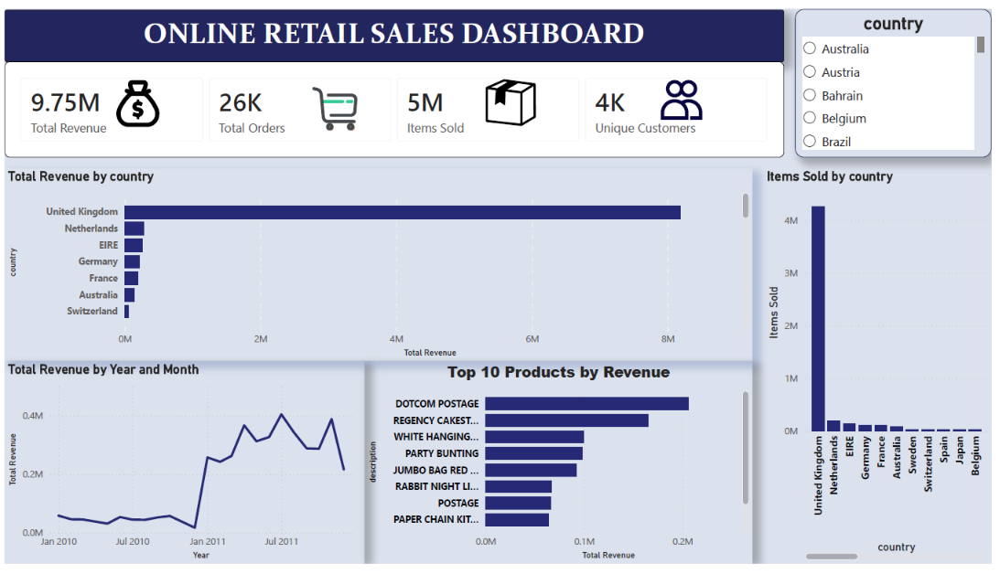
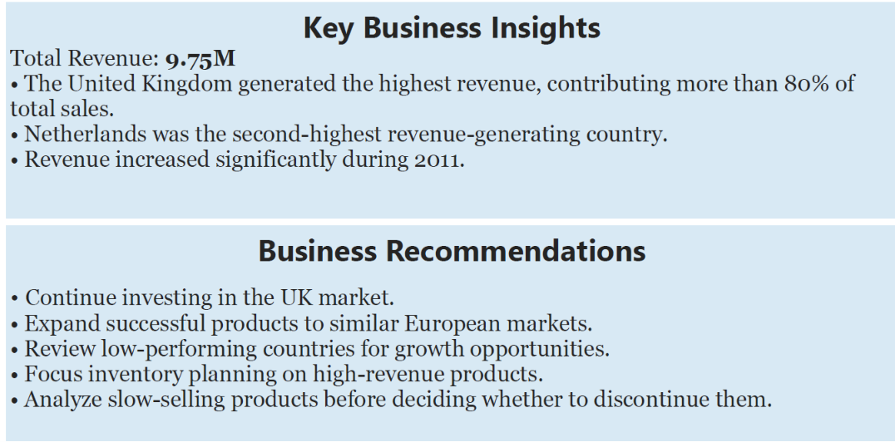

# Online-Retail-Sales-Analysis
Power BI dashborad analyzing online retail sales using SQL and DAX
## Dashbord preview

### Dashboard Page 1

### Dashboard Page 2

# Online-Retail-Sales-Analysis Dashboard

## Project Overview
Built an interactive Power BI dashboard to analyze online retail sales.

## Tools Used
- SQL
- Power BI
- DAX
- Excel

## KPIs
- Total Revenue
- Total Orders
- Total Quantity
- Unique Customers

## Business Insights
- United Kingdom generated the highest revenue.
- Most sales came from a small number of countries.
- Revenue trends changed over time.
- Customer purchases were concentrated in a few markets.
